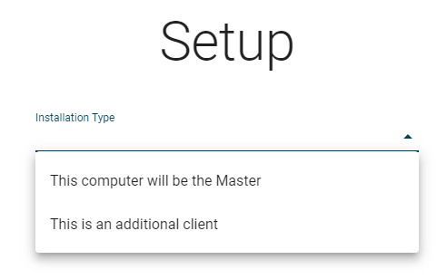
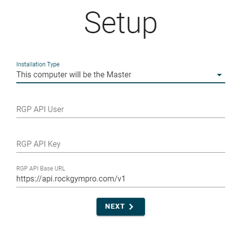
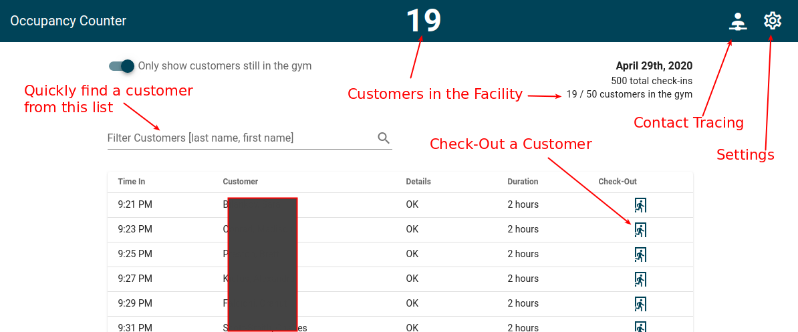

# RGP Occupancy Counter & Contact Tracing
This is a small application built on top of the RGP API to help climbing gyms during the limited re-opening periods after COVID-19.  It adds a Check-Out feature to help with having a customer occupancy counter, as well as making contact tracing easy.  Contact tracing reports are included.  Simply look up a customer and get a contact list of every customer who had overlapping check-ins.  Alternatively, you can provide an array of date ranges instead of a single customer.  Even if you plan on using a reservation system to control occupancy, having customers check-out of the gym will greatly help with contact tracing should a customer or staff test positive for COVID-19.

## Download & Installation
TODO

## Setup
When you open the program for the first time, you'll need to go through a quick setup.  There are two types of installations; Master and Client.

	

### Master
Master is where all data is stored, and also acts as a server to sync data between all clients.  The Master needs to be running for any clients to work.  There should only be one Master configured and running (one per location, if you have multiple locations).  The rest should be configured as Clients.

You'll need to enter your API username and key that you have from RGP.  Don't know where to get that info?  See this [Google Doc](https://docs.google.com/document/d/1J_r1QkUphSsaPa-KdqsUv0xd7r39qp3M4169ouv6rXc/edit) from RGP on how to generate your API key.  You should not need to change the default URL listed in the `RGP API Base URL` field.  Clicking `Next` will check your API key.  If you get an error here, check that your username and key were entered correctly.  Next select the facility you are setting up from the drop down list and click `Finish`.  Setup is now complete!

	

**Note:** *The first time you open the program, you may get a Windows Firewall popup asking if you want to allow this application through the firewall.  Select Yes if you plan on running this on multiple computers.  If you dismiss this prompt, clients will not be able to connect until you manually add an exception in your firewall.*

### Client
Once you have a Master configured and running at your location, you can install additional clients.  Clients must reside on the same network as the Master. Once you select `Client` as the `Installation Type` and click `Next`, the application will scan your network looking for the Master.  As soon as it finds the master, Client Setup will be complete and the Client will automatically sync with the Master.

**Reasons the Client Setup Might Fail**
- There is no Master configured
- The Master is not running, or the computer it's on went into sleep mode
- The Windows Firewall on the Master is blocking incoming connections.  Manually add an exception in the firewall, or turn it off.
- The Client and Master are not on the same network.  If you're using WiFi, make sure one is not on the public network, while the other is on your internal network.
- You have a more complex network layout and this application does not know where to look.  In this case, you can click `Advanded Options` and enter the IP address of the machine that is running as the Master.

## Main View (Check-Ins)
The main page shows a list of check-ins pulled from RGP.  This list will automatically get any new check-ins every 20 seconds.  This view will be very similar to what is displayed in RGP's Check-In Module with a couple of differences.

	

### Visit Duration
The Check-In List has a column for `Duration`.  This is the amount of time the customer has been in the gym.  This time will be highlighted in red if they have been there longer than your max duration time (editable in settings).

### Check-Out
On the right side of the Check-In list will be a Check-Out icon.  Clicking this icon will mark the selected customer as checked-out as of the current time.  If the customer was already Checked-Out, it will display a cancel icon instead.  Clicking this will remove the check-out for this customer and show them as in the facility.

### View All Check-Ins
By default, only customers that are currently in the facility will be displayed in the list.  When a customer is marked as Checked-Out, they will be removed from the list.  To display all customers for the day, including ones that are no longer in the facility, simply switch of the option `Only show customer still in the gym` at the top left of the page.

### Occupancy
The menu bar at the top of the screen will display the number of customers currently in the gym.  This number will be highlighted in red if it is at, or above, your set max occupancy (editable in settings).

### Filter Customers
The text field at the top of the Check-In list allows you to quickly filter the list of customers.  Search is the same format as RGP - lastname, firstname - and the list will be updated as you type.

## Settings
Clicking the gear icon at the top right of the menu bar will bring you to the settings page.  Some settings differ between the Master and Client

| Setting | Description |
| ----------- | ----------- |
| Maximum Duration (*Master only*) | Set the max amount of time that customers can stay in your facility.  If a customer exceeds this time, they will be highlighted on the Check-In Screen. *This setting is replicated to clients* |
| Maximum Number of Customers (*Master Only*) | Set the maximum occupancy of your facility. The occupancy count will be highlighted red if this number is reached or exceeded. *This setting is replicated to clients* |
| Disable Transitions | Animations are turned off when this options is enabled.  This can help slower computers |
| Dark Mode | Changes to a dark color theme |
| Server Port (*Advanced - Master only*) | This should remain on port 3000 unless you have another application using that port.  If you change this, you'll need to click the `Restart Server` button for it to take effect. |
| Purge Data (*Advanced - Master only*) | This will delete all Check-In/Check-Out data that has been saved for this facility as well as reset the configuration.  This data is not recoverable once deleted |
| IP & Port of Master (*Advanced - Client Only*) | If you need to specify the IP or Port to connect to on the Master |
| Reset Configuration (*Advanced - Client Only*) | This will disconnect the Client from the Master and put it back into Setup mode.  No data is stored on the client, so no data is deleted in this process |

## Contact Tracing
There are a few different reports available to help with Contact Tracing

### Contact With Customer
Here you can look up a single customer and get back a contact list of all customers that were in the gym at the same time.
1. To start, enter the name (or part of the name) of a customer and click the search button
2. Click on the name you want from the result list of customers
3. The Occupancy Counter will then find customers who have overlapping check-ins with the selected customer
4. Click `Export Contact List` to save a CSV file of these customers, their contact info, and their overlapping check-ins.  This can take anywhere from a few seconds to several minutes as contact info needs to be downloaded from RGP's API.

### Date Ranges
The `Date Ranges` report functions much like `Contact with Customer` report.  However, instead of searching for a single customer, you will input one or more time ranges on specific days.  A contact list will be generated of customers who have overlapping check-ins with your provided times.

### Full Data Export
This is a simple data export.  Enter start and end dates and click `Save as .CSV`.  A list of all check-ins between those dates will be generated, along with their check-out times.  No contact info is retrieved in this report.
